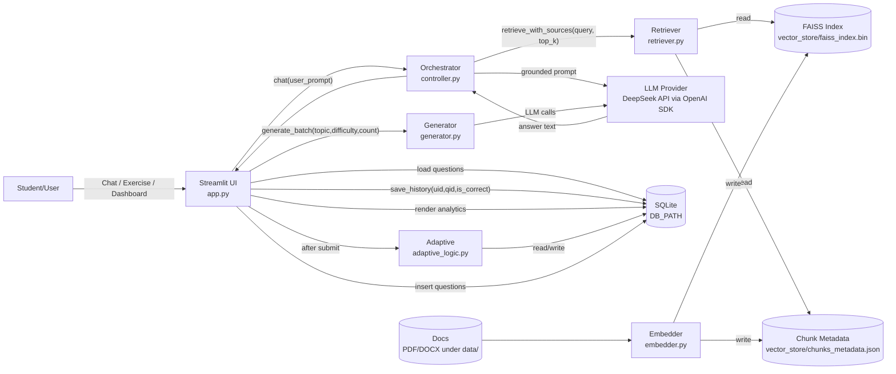
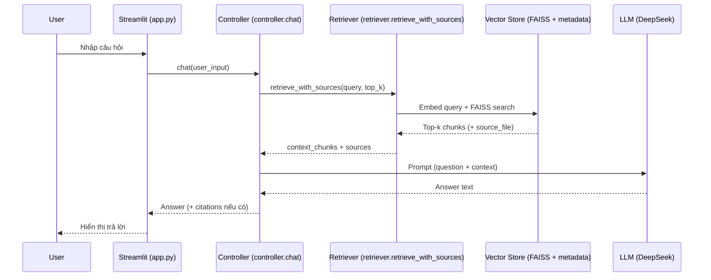
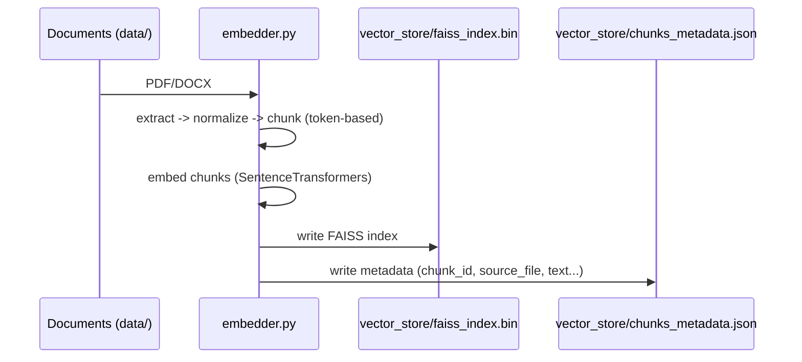
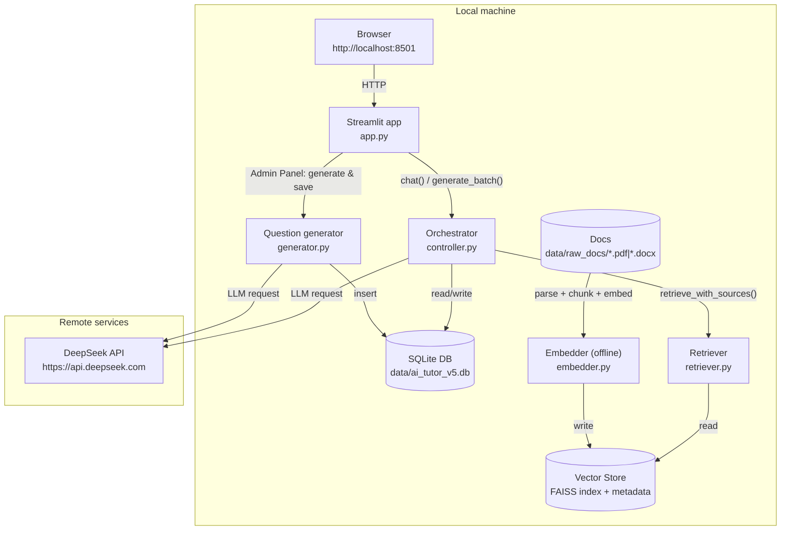
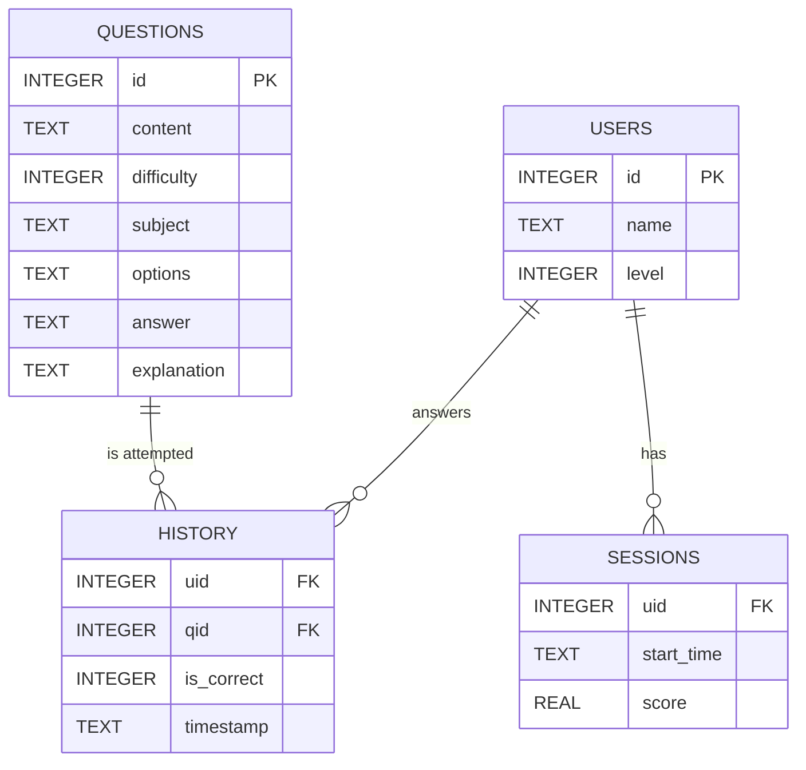

# Kiến trúc hệ thống AI Tutor V5.1

Tài liệu này mô tả kiến trúc (components + luồng dữ liệu) của AI Tutor trong repo hiện tại.

> Ghi chú: Một số comment/tài liệu cũ có nhắc “Gemini/Ollama”. Trong code hiện tại, các lời gọi LLM chính đang dùng **DeepSeek API** thông qua **OpenAI SDK** (xem `controller.py`, `generator.py`, `config.py`). Repo vẫn giữ biến `GEMINI_API_KEY` như một tuỳ chọn/legacy.

---

## 1) Tổng quan thành phần

### Tầng giao diện (Presentation)
- `app.py`: Streamlit UI gồm 3 tab: **Chat**, **Exercise**, **Dashboard**.
- `dashboard.py`: Vẽ biểu đồ học tập bằng Plotly.

### Tầng điều phối (Orchestration)
- `controller.py`: “đầu não” điều phối 2 luồng chính:
  - Chat có RAG: retrieve context → build prompt → gọi LLM → trả lời + trích dẫn nguồn (nếu có).
  - Tạo bài tập theo độ khó thích nghi: gọi `adaptive_logic.get_next_difficulty()` + `generator.generate()`.

### Tầng RAG (Retrieval-Augmented Generation)
- `embedder.py`: pipeline offline để tạo **FAISS index** + **metadata** từ tài liệu PDF/DOCX.
- `retriever.py`: runtime retrieval top-k từ FAISS dựa trên embedding (SentenceTransformers).
- `vector_store/`:
  - `faiss_index.bin`: chỉ mục vector.
  - `chunks_metadata.json`: metadata cho từng chunk (text, source_file, chunk_id...).

### Tầng sinh câu hỏi (Question Generation)
- `generator.py`: sinh câu hỏi trắc nghiệm JSON bằng LLM + harden parsing + validate theo `schema.json`.
- `json_parser.py`: (tuỳ chọn) parse JSON string + validate schema + insert vào bảng `questions`.

### Tầng học thích nghi (Adaptive Learning)
- `adaptive_logic.py`: cập nhật level dựa trên lịch sử trả lời:
  - 3 đúng liên tiếp → +1 level
  - 2 sai liên tiếp → -1 level
  - clamp về [1..5]

### Tầng lưu trữ (Storage)
- SQLite:
  - `schema.sql`: định nghĩa bảng `users`, `questions`, `history`, `sessions`.
  - `init_db.py`: tạo DB theo schema.
  - `sqlite_manager.py`: DAO/queries: lấy câu hỏi, lưu history, thống kê.

### Cấu hình & vận hành
- `config.py`: đọc `.env`, thiết lập đường dẫn DB/FAISS/logs, tham số chunking/top-k, khoá API.
- `logs/`: log file (theo `LOG_PATH`).

---

## 2) Sơ đồ kiến trúc (Component Diagram)

---

## 3) Luồng runtime chính

### 3.1 Chat Tutor (RAG)

**Điểm chốt kỹ thuật**
- Retrieval dùng cosine-similarity thông qua FAISS inner-product (vector đã normalize).
- Khi quota/rate-limit LLM, `controller.py` có thể fallback trả về “retrieval-only” context.

### 3.2 Luyện tập (Exercise) + Adaptive

Luồng Exercise trong `app.py` hiện chủ yếu **lấy câu hỏi từ SQLite** theo `level` (và bộ lọc môn học), sau đó:
1) người học chọn đáp án
2) lưu kết quả vào `history`
3) cập nhật level mới bằng `adaptive_logic.get_next_difficulty(uid)`
4) dashboard đọc lại thống kê từ DB.

---

## 4) Luồng offline build Vector Store

Chỉ cần chạy khi:
- thay đổi tài liệu trong `data/`
- hoặc muốn rebuild FAISS index.

---

## 5) “Entry points” và artifacts

### Entry points (chạy chương trình)
- UI: `streamlit run app.py`
- Init DB: `python init_db.py`
- Build vector index: `python embedder.py`
- Evaluate retrieval: `python rag_tester.py`

### Artifacts quan trọng
- SQLite DB: theo `DB_PATH` (mặc định `data/ai_tutor_v5.db`)
- Vector store:
  - `vector_store/faiss_index.bin`
  - `vector_store/chunks_metadata.json`

---

## 6) Mapping file → trách nhiệm (tóm tắt)

- UI: `app.py`, `dashboard.py`
- Điều phối: `controller.py`
- RAG: `embedder.py`, `retriever.py`
- Sinh câu hỏi: `generator.py`, `schema.json`, (tuỳ chọn) `json_parser.py`
- Adaptive: `adaptive_logic.py`
- DB: `schema.sql`, `init_db.py`, `sqlite_manager.py`
- Cấu hình: `config.py`, `.env`

---

## 7) Sơ đồ triển khai (Deployment: local vs remote API)

Mô hình triển khai mặc định là **chạy local** (Streamlit + SQLite + FAISS), và gọi **remote LLM API** (DeepSeek) qua Internet.

**Ghi chú**
- Chế độ **DEMO** có thể chạy mà không cần remote API bằng cách trỏ `DB_PATH` sang `mock_data/mock_db.sqlite` (Exercise/Dashboard vẫn dùng được).
- Chat RAG cần có artifacts `vector_store/faiss_index.bin` và `vector_store/chunks_metadata.json` (tạo bằng `python embedder.py`).

---

## 8) ERD SQLite (users/questions/history/sessions)

ERD dưới đây bám sát `schema.sql`. (Tên bảng trong DB là chữ thường; sơ đồ dùng chữ hoa để dễ đọc.)

