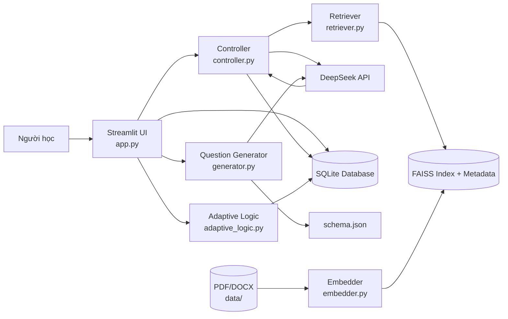
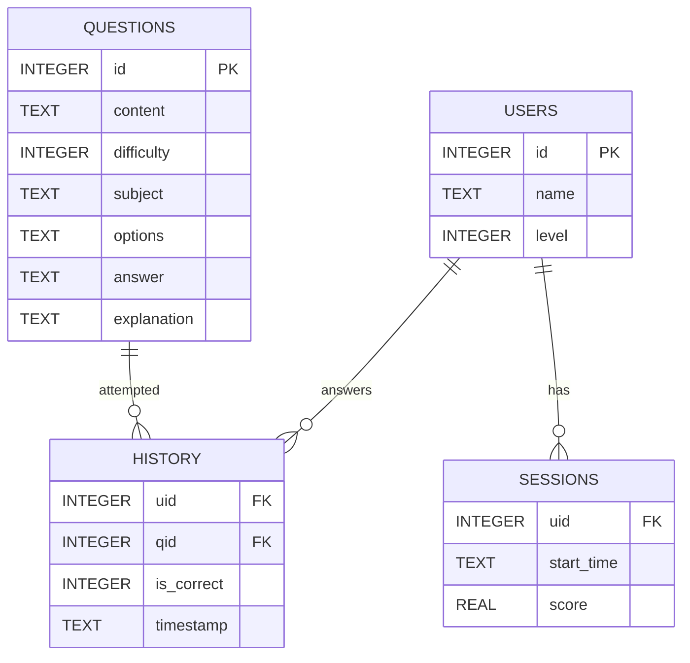
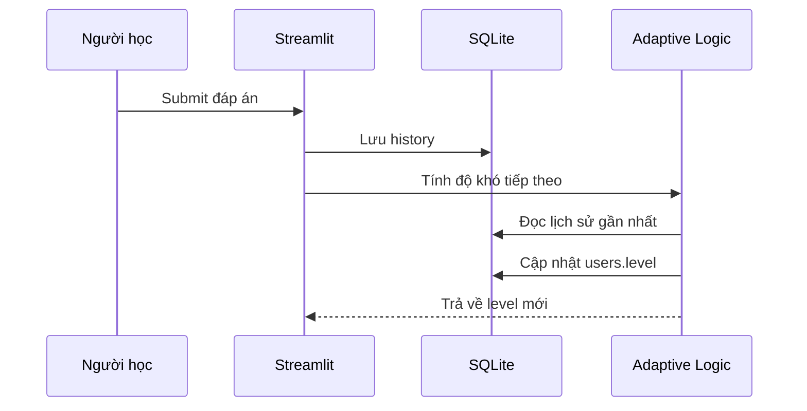

# BÁO CÁO DỰ ÁN

# AI Tutor - Hệ thống trợ lý học tập cá nhân hóa ứng dụng RAG và học thích nghi

## Thông tin chung

| Nội dung | Thông tin |
| --- | --- |
| Trường/Khoa | ........................................................ |
| Học phần | ........................................................ |
| Giảng viên hướng dẫn | ........................................................ |
| Sinh viên/Nhóm thực hiện | ........................................................ |
| Lớp | ........................................................ |
| Mã sinh viên | ........................................................ |
| Thời gian thực hiện | ........................................................ |

---

## Tóm tắt

Đề tài xây dựng hệ thống AI Tutor, một trợ lý học tập cá nhân hóa có khả năng hỗ trợ người học thông qua ba chức năng chính: hỏi đáp dựa trên tài liệu, luyện tập trắc nghiệm theo độ khó thích nghi và theo dõi kết quả học tập bằng dashboard trực quan.

Hệ thống được phát triển bằng Python, sử dụng Streamlit cho giao diện, SQLite để lưu trữ dữ liệu, Sentence Transformers và FAISS để xây dựng pipeline RAG, đồng thời tích hợp mô hình ngôn ngữ lớn thông qua DeepSeek API tương thích OpenAI SDK. Cách tiếp cận RAG giúp câu trả lời của chatbot bám sát tài liệu nội bộ, trong khi cơ chế học thích nghi điều chỉnh độ khó dựa trên lịch sử trả lời của người học.

Kết quả đạt được là một ứng dụng có thể chạy cục bộ, hỗ trợ tạo câu hỏi trắc nghiệm bằng AI, lưu lịch sử làm bài, phân tích năng lực học tập và đánh giá chất lượng truy xuất tài liệu bằng các chỉ số Precision@3 và MRR.

---

## Mục lục

1. Mở đầu  
2. Cơ sở lý thuyết và công nghệ sử dụng  
3. Phân tích yêu cầu hệ thống  
4. Thiết kế hệ thống  
5. Cài đặt và triển khai  
6. Kiểm thử và đánh giá  
7. Kết quả đạt được  
8. Hạn chế và hướng phát triển  
9. Kết luận  
10. Tài liệu tham khảo  
11. Phụ lục  

---

## Danh mục từ viết tắt

| Từ viết tắt | Ý nghĩa |
| --- | --- |
| AI | Artificial Intelligence - Trí tuệ nhân tạo |
| API | Application Programming Interface - Giao diện lập trình ứng dụng |
| DB | Database - Cơ sở dữ liệu |
| FAISS | Facebook AI Similarity Search |
| JSON | JavaScript Object Notation |
| LLM | Large Language Model - Mô hình ngôn ngữ lớn |
| MRR | Mean Reciprocal Rank |
| RAG | Retrieval-Augmented Generation |
| UI | User Interface - Giao diện người dùng |

---

## 1. Mở đầu

### 1.1 Lý do chọn đề tài

Trong bối cảnh các công cụ trí tuệ nhân tạo ngày càng được ứng dụng rộng rãi trong giáo dục, nhu cầu xây dựng các hệ thống hỗ trợ học tập cá nhân hóa trở nên cần thiết. Người học không chỉ cần một chatbot trả lời câu hỏi, mà còn cần một công cụ có khả năng dựa vào tài liệu riêng, tạo bài tập phù hợp với trình độ và theo dõi quá trình tiến bộ.

Các chatbot thông thường thường trả lời dựa trên kiến thức tổng quát của mô hình, dẫn đến rủi ro sai lệch hoặc không bám sát nội dung môn học. Vì vậy, đề tài lựa chọn hướng tiếp cận Retrieval-Augmented Generation (RAG) để kết hợp khả năng sinh ngôn ngữ của LLM với nguồn tài liệu nội bộ. Bên cạnh đó, hệ thống bổ sung cơ chế học thích nghi nhằm điều chỉnh độ khó bài tập theo kết quả làm bài của từng người học.

### 1.2 Mục tiêu đề tài

Đề tài hướng tới các mục tiêu chính sau:

- Xây dựng hệ thống trợ lý học tập có giao diện trực quan, dễ sử dụng.
- Cho phép người học hỏi đáp với chatbot dựa trên tài liệu PDF/DOCX đã được nạp vào hệ thống.
- Tạo câu hỏi trắc nghiệm bằng AI theo chủ đề và độ khó.
- Lưu trữ thông tin người học, câu hỏi và lịch sử làm bài bằng SQLite.
- Tự động điều chỉnh độ khó dựa trên chuỗi câu trả lời đúng/sai.
- Cung cấp dashboard phân tích kết quả học tập.
- Xây dựng công cụ đánh giá chất lượng truy xuất tài liệu trong pipeline RAG.

### 1.3 Đối tượng và phạm vi nghiên cứu

Đối tượng nghiên cứu của đề tài là hệ thống AI Tutor hỗ trợ học tập cá nhân hóa. Phạm vi triển khai tập trung vào phiên bản chạy cục bộ trên máy tính cá nhân, sử dụng SQLite làm cơ sở dữ liệu và gọi LLM thông qua API bên ngoài.

Phạm vi chức năng gồm:

- Chatbot có RAG.
- Luyện tập trắc nghiệm.
- Sinh câu hỏi bằng AI.
- Học thích nghi theo lịch sử trả lời.
- Dashboard thống kê học tập.
- Đánh giá truy xuất RAG.

Các chức năng ngoài phạm vi hiện tại:

- Phân quyền người dùng nâng cao.
- Quản lý lớp học nhiều cấp.
- Triển khai server nhiều người dùng đồng thời.
- Chấm điểm tự luận hoặc xử lý bài tập dạng file.

### 1.4 Phương pháp thực hiện

Quá trình thực hiện đề tài gồm các bước:

1. Khảo sát yêu cầu và xác định chức năng chính.
2. Thiết kế kiến trúc hệ thống theo các module độc lập.
3. Xây dựng cơ sở dữ liệu SQLite.
4. Cài đặt pipeline xử lý tài liệu và FAISS index.
5. Tích hợp LLM để chat và sinh câu hỏi.
6. Xây dựng giao diện Streamlit.
7. Cài đặt logic học thích nghi.
8. Kiểm thử các module chính và đánh giá retrieval.

---

## 2. Cơ sở lý thuyết và công nghệ sử dụng

### 2.1 Mô hình ngôn ngữ lớn

Mô hình ngôn ngữ lớn (LLM) là mô hình AI có khả năng hiểu và sinh ngôn ngữ tự nhiên. Trong dự án này, LLM được sử dụng cho hai nhiệm vụ:

- Sinh câu trả lời trong chức năng Chat Tutor.
- Sinh câu hỏi trắc nghiệm theo chủ đề và độ khó.

Hệ thống hiện tích hợp DeepSeek API thông qua OpenAI SDK. Cách tích hợp này giúp tận dụng API tương thích chuẩn OpenAI, dễ thay đổi hoặc mở rộng provider trong tương lai.

### 2.2 Retrieval-Augmented Generation

RAG là kỹ thuật kết hợp truy xuất thông tin với sinh ngôn ngữ. Thay vì gửi câu hỏi trực tiếp cho LLM, hệ thống sẽ:

1. Truy xuất các đoạn tài liệu liên quan nhất.
2. Ghép các đoạn này vào prompt.
3. Gửi prompt đã có ngữ cảnh cho LLM.
4. Sinh câu trả lời bám sát tài liệu.

Ưu điểm của RAG:

- Giảm rủi ro trả lời không đúng tài liệu.
- Có thể cập nhật tri thức bằng cách thay đổi tài liệu nguồn.
- Không cần fine-tune mô hình.
- Phù hợp với hệ thống học tập theo tài liệu môn học.

### 2.3 Vector embedding và FAISS

Embedding là biểu diễn văn bản dưới dạng vector số. Các đoạn văn bản có ý nghĩa gần nhau sẽ có vector gần nhau trong không gian vector.

Trong dự án:

- Sentence Transformers chuyển tài liệu và câu hỏi thành vector.
- FAISS lưu trữ và tìm kiếm vector nhanh.
- Hệ thống lấy top-k đoạn tài liệu liên quan nhất để đưa vào prompt.

### 2.4 Học thích nghi

Học thích nghi là phương pháp điều chỉnh nội dung học tập dựa trên năng lực người học. Dự án áp dụng logic đơn giản nhưng dễ hiểu:

- Nếu người học trả lời đúng 3 câu liên tiếp, tăng độ khó.
- Nếu người học trả lời sai 2 câu liên tiếp, giảm độ khó.
- Nếu không thỏa điều kiện, giữ nguyên độ khó.

Cách tiếp cận này giúp hệ thống phản ứng với kết quả học tập mà không cần mô hình machine learning phức tạp.

### 2.5 Công nghệ sử dụng

| Nhóm | Công nghệ | Vai trò |
| --- | --- | --- |
| Ngôn ngữ | Python 3.10+ | Phát triển toàn bộ hệ thống |
| Giao diện | Streamlit | Xây dựng UI web cục bộ |
| Cơ sở dữ liệu | SQLite | Lưu user, câu hỏi, lịch sử và phiên học |
| LLM | DeepSeek API qua OpenAI SDK | Chat và sinh câu hỏi |
| Embedding | Sentence Transformers | Mã hóa văn bản thành vector |
| Vector search | FAISS | Tìm kiếm đoạn tài liệu liên quan |
| Đọc tài liệu | pypdf, python-docx | Trích xuất nội dung PDF/DOCX |
| Biểu đồ | Plotly | Hiển thị dashboard học tập |
| Kiểm tra JSON | jsonschema | Validate câu hỏi do AI sinh |

---

## 3. Phân tích yêu cầu hệ thống

### 3.1 Yêu cầu chức năng

#### 3.1.1 Quản lý người học

Hệ thống cho phép người dùng nhập tên để tạo hoặc tải lại user. Mỗi user có một độ khó hiện tại được lưu trong bảng `users`.

#### 3.1.2 Chat Tutor

Người học có thể đặt câu hỏi tự do. Hệ thống tìm tài liệu liên quan trong FAISS index, sau đó dùng LLM để sinh câu trả lời dựa trên ngữ cảnh đã truy xuất.

#### 3.1.3 Luyện tập trắc nghiệm

Người học có thể tải câu hỏi theo độ khó hiện tại, chọn đáp án A/B/C/D và nhận phản hồi đúng/sai cùng giải thích.

#### 3.1.4 Sinh câu hỏi bằng AI

Admin có thể nhập chủ đề, chọn độ khó và số lượng câu hỏi cần tạo. Hệ thống gọi LLM để sinh câu hỏi, validate theo schema rồi lưu vào database.

#### 3.1.5 Học thích nghi

Sau mỗi lần trả lời, hệ thống cập nhật lịch sử và tính lại độ khó mới dựa trên chuỗi đúng/sai gần nhất.

#### 3.1.6 Dashboard học tập

Dashboard hiển thị các chỉ số:

- Tổng số câu đã làm.
- Số câu đúng.
- Tỷ lệ chính xác.
- Streak hiện tại.
- Phân bố đúng/sai theo môn.
- Tiến trình học tập theo thời gian.
- Kết quả theo độ khó.

### 3.2 Yêu cầu phi chức năng

| Yêu cầu | Mô tả |
| --- | --- |
| Dễ sử dụng | Giao diện đơn giản, thao tác trực tiếp trên Streamlit |
| Dễ triển khai | Có thể chạy local với Python và SQLite |
| Dễ mở rộng | Các chức năng được tách thành module riêng |
| Tính ổn định | Có validate input, schema và xử lý lỗi cơ bản |
| Tính tái sử dụng | Các module như retriever, generator, database helper có thể gọi độc lập |
| Bảo mật cơ bản | API key được đặt trong `.env`, không hard-code trong source |

---

## 4. Thiết kế hệ thống

### 4.1 Kiến trúc tổng thể

Hệ thống được tổ chức theo mô hình nhiều tầng:

- Tầng giao diện: `app.py`, `dashboard.py`.
- Tầng điều phối: `controller.py`.
- Tầng RAG: `embedder.py`, `retriever.py`.
- Tầng sinh câu hỏi: `generator.py`, `json_parser.py`, `schema.json`.
- Tầng học thích nghi: `adaptive_logic.py`.
- Tầng dữ liệu: `schema.sql`, `init_db.py`, `sqlite_manager.py`.
- Tầng cấu hình: `config.py`, `.env`.



### 4.2 Thiết kế cơ sở dữ liệu

Database được định nghĩa trong `schema.sql`, gồm 4 bảng chính.

#### Bảng `users`

| Cột | Kiểu | Mô tả |
| --- | --- | --- |
| `id` | INTEGER | Khóa chính |
| `name` | TEXT | Tên người học |
| `level` | INTEGER | Độ khó hiện tại, từ 1 đến 5 |

#### Bảng `questions`

| Cột | Kiểu | Mô tả |
| --- | --- | --- |
| `id` | INTEGER | Khóa chính |
| `content` | TEXT | Nội dung câu hỏi |
| `difficulty` | INTEGER | Độ khó |
| `subject` | TEXT | Chủ đề hoặc môn học |
| `options` | TEXT | JSON chứa lựa chọn A/B/C/D |
| `answer` | TEXT | Đáp án đúng |
| `explanation` | TEXT | Giải thích |

#### Bảng `history`

| Cột | Kiểu | Mô tả |
| --- | --- | --- |
| `uid` | INTEGER | Khóa ngoại tới `users` |
| `qid` | INTEGER | Khóa ngoại tới `questions` |
| `is_correct` | INTEGER | Kết quả đúng/sai |
| `timestamp` | TEXT | Thời điểm trả lời |

#### Bảng `sessions`

| Cột | Kiểu | Mô tả |
| --- | --- | --- |
| `uid` | INTEGER | Khóa ngoại tới `users` |
| `start_time` | TEXT | Thời điểm bắt đầu |
| `score` | REAL | Điểm hoặc tỷ lệ kết quả |

### 4.3 Sơ đồ ERD



### 4.4 Thiết kế pipeline RAG

Pipeline RAG gồm hai giai đoạn.

#### Giai đoạn build index

1. Đọc file PDF/DOCX trong thư mục `data/`.
2. Trích xuất text.
3. Chuẩn hóa text.
4. Chia text thành các chunk theo token.
5. Tạo embedding cho từng chunk.
6. Lưu vector vào FAISS index.
7. Lưu metadata gồm `chunk_id`, `source_file`, `text`.

#### Giai đoạn truy xuất khi chat

1. Người dùng nhập câu hỏi.
2. Hệ thống embed câu hỏi.
3. FAISS tìm top-k chunk gần nhất.
4. Các chunk được đưa vào prompt.
5. LLM sinh câu trả lời.

### 4.5 Thiết kế luồng học thích nghi



### 4.6 Vị trí chèn hình minh họa thiết kế hệ thống

**Hình 4.1. Sơ đồ kiến trúc tổng thể của hệ thống AI Tutor**

> Chèn ảnh sơ đồ kiến trúc hoặc ảnh minh họa các module chính của hệ thống tại đây.

**Hình 4.2. Sơ đồ cơ sở dữ liệu hoặc ERD**

> Chèn ảnh ERD/database schema tại đây nếu giảng viên yêu cầu minh họa trực quan thay vì sơ đồ Mermaid.

---

## 5. Cài đặt và triển khai

### 5.1 Cấu trúc file chính

| File | Chức năng |
| --- | --- |
| `app.py` | Giao diện chính của ứng dụng |
| `dashboard.py` | Dashboard phân tích học tập |
| `controller.py` | Điều phối chat, retrieval và LLM |
| `generator.py` | Sinh câu hỏi bằng AI |
| `adaptive_logic.py` | Cập nhật độ khó |
| `sqlite_manager.py` | Truy vấn và ghi dữ liệu SQLite |
| `embedder.py` | Build FAISS index từ tài liệu |
| `retriever.py` | Truy xuất top-k chunk |
| `rag_tester.py` | Đánh giá retrieval |
| `generate_mock_data.py` | Tạo dữ liệu mẫu |
| `config.py` | Cấu hình runtime |

### 5.2 Cấu hình môi trường

Các biến môi trường quan trọng trong `.env`:

```env
DEEPSEEK_API_KEY=your_api_key_here
DEEPSEEK_MODEL=deepseek-chat
DB_PATH=data/ai_tutor_v5.db
FAISS_INDEX_PATH=vector_store/faiss_index.bin
LOG_PATH=logs/app.log
CHUNK_SIZE=256
CHUNK_OVERLAP=50
TOP_K=3
EMBEDDING_MODEL_NAME=all-MiniLM-L6-v2
```

### 5.3 Cài đặt dependencies

```bash
python -m venv .venv
pip install --upgrade pip
pip install -r requirements.txt
```

### 5.4 Khởi tạo database

```bash
python init_db.py
```

### 5.5 Build vector store

Đặt tài liệu PDF/DOCX vào thư mục `data/`, sau đó chạy:

```bash
python embedder.py
```

Kết quả:

- `vector_store/faiss_index.bin`
- `vector_store/chunks_metadata.json`

### 5.6 Chạy ứng dụng

```bash
streamlit run app.py
```

Sau khi chạy, người dùng có thể truy cập giao diện Streamlit trên trình duyệt, thường tại địa chỉ:

```text
http://localhost:8501
```

### 5.7 Vị trí chèn ảnh demo giao diện ứng dụng

**Hình 5.1. Giao diện chính của ứng dụng AI Tutor**

> Chèn ảnh màn hình trang chính của ứng dụng sau khi chạy Streamlit.

**Hình 5.2. Giao diện Chat Tutor**

> Chèn ảnh người dùng nhập câu hỏi và hệ thống trả lời dựa trên tài liệu.

**Hình 5.3. Giao diện luyện tập trắc nghiệm**

> Chèn ảnh tab Exercise, câu hỏi trắc nghiệm, lựa chọn đáp án và phản hồi đúng/sai.

**Hình 5.4. Giao diện Dashboard**

> Chèn ảnh dashboard hiển thị thống kê học tập và các biểu đồ Plotly.

**Hình 5.5. Giao diện Admin Panel sinh câu hỏi**

> Chèn ảnh sidebar hoặc admin panel khi tạo câu hỏi theo chủ đề và độ khó.

---

## 6. Kiểm thử và đánh giá

### 6.1 Kiểm tra cú pháp và import

Trong quá trình rà soát, dự án đã được kiểm tra bằng:

```bash
python -m compileall -q .
```

Kết quả: không phát hiện lỗi cú pháp Python.

Ngoài ra, các module chính cũng được import thử để kiểm tra lỗi runtime cơ bản:

- `app`
- `controller`
- `dashboard`
- `embedder`
- `generator`
- `init_db`
- `json_parser`
- `retriever`
- `sqlite_manager`

### 6.2 Kiểm tra dependencies

```bash
python -m pip check
```

Kết quả: không phát hiện xung đột package trong môi trường hiện tại.

### 6.3 Kiểm tra luồng database

Các thao tác đã được kiểm tra:

- Khởi tạo database.
- Insert câu hỏi theo schema.
- Tạo user.
- Lưu lịch sử trả lời.
- Tính toán độ khó tiếp theo.
- Lấy thống kê học tập.

Kết quả: luồng cơ bản hoạt động đúng.

### 6.4 Đánh giá RAG

Dự án có script `rag_tester.py` để đánh giá truy xuất tài liệu. Script tự tạo 20 test query từ metadata hiện tại, sau đó tính:

- Precision@3.
- Mean Reciprocal Rank (MRR).
- Chi tiết từng truy vấn.

Chạy bằng lệnh:

```bash
python rag_tester.py
```

### 6.5 Hạn chế kiểm thử

Hiện tại dự án chưa có test suite đầy đủ bằng `pytest`. Các kiểm tra chủ yếu là smoke test, kiểm tra compile, import module, kiểm tra flow database và kiểm tra retrieval. Trong tương lai nên bổ sung unit test và integration test để tăng độ tin cậy.

### 6.6 Vị trí chèn ảnh test case và kết quả kiểm thử

**Hình 6.1. Kết quả kiểm tra cú pháp bằng `compileall`**

> Chèn ảnh terminal thể hiện lệnh kiểm tra cú pháp chạy thành công.

**Hình 6.2. Kết quả kiểm tra dependency bằng `pip check`**

> Chèn ảnh terminal thể hiện không có xung đột package.

**Hình 6.3. Test case luồng database**

> Chèn ảnh hoặc bảng test case cho các bước: khởi tạo database, insert câu hỏi, tạo user, lưu history và cập nhật level.

**Hình 6.4. Kết quả đánh giá RAG bằng `rag_tester.py`**

> Chèn ảnh terminal hoặc bảng kết quả Precision@3, MRR và chi tiết truy xuất.

**Bảng 6.1. Bảng tổng hợp test case đề xuất**

| Mã test | Chức năng | Dữ liệu kiểm thử | Kết quả mong đợi | Trạng thái |
| --- | --- | --- | --- | --- |
| TC01 | Khởi tạo database | Chạy `python init_db.py` | Tạo đủ bảng `users`, `questions`, `history`, `sessions` | Đạt/Chưa đạt |
| TC02 | Tải câu hỏi luyện tập | User có level hợp lệ | Hiển thị câu hỏi đúng độ khó | Đạt/Chưa đạt |
| TC03 | Lưu lịch sử trả lời | Chọn đáp án và submit | Ghi thêm bản ghi vào `history` | Đạt/Chưa đạt |
| TC04 | Cập nhật độ khó | 3 câu đúng hoặc 2 câu sai liên tiếp | Level tăng hoặc giảm đúng quy tắc | Đạt/Chưa đạt |
| TC05 | Chat RAG | Nhập câu hỏi liên quan tài liệu | Trả lời có sử dụng context truy xuất | Đạt/Chưa đạt |
| TC06 | Sinh câu hỏi bằng AI | Nhập topic, difficulty, count | Câu hỏi hợp lệ schema và được lưu DB | Đạt/Chưa đạt |
| TC07 | Dashboard | User có lịch sử làm bài | Hiển thị số liệu và biểu đồ | Đạt/Chưa đạt |

---

## 7. Kết quả đạt được

Sau quá trình xây dựng, hệ thống đã đạt được các kết quả chính:

- Xây dựng được giao diện Streamlit gồm Chat, Exercise và Dashboard.
- Tạo được pipeline RAG để truy xuất nội dung từ tài liệu PDF/DOCX.
- Tích hợp LLM để sinh câu trả lời và câu hỏi trắc nghiệm.
- Thiết kế cơ sở dữ liệu SQLite lưu user, câu hỏi, history và session.
- Cài đặt logic học thích nghi dựa trên lịch sử đúng/sai.
- Hiển thị dashboard phân tích kết quả học tập.
- Có script tạo dữ liệu mẫu phục vụ demo.
- Có script đánh giá retrieval bằng Precision@3 và MRR.

### 7.1 Ưu điểm

- Kiến trúc module rõ ràng, dễ bảo trì.
- Có kiểm tra schema cho dữ liệu câu hỏi do AI sinh.
- Có thể chạy local, phù hợp demo và học tập.
- Có khả năng mở rộng sang nhiều môn học hoặc tài liệu khác nhau.
- Dashboard cung cấp góc nhìn trực quan về quá trình học.

### 7.2 Ý nghĩa thực tiễn

Hệ thống có thể được sử dụng như một bản mẫu cho ứng dụng học tập cá nhân hóa. Người học có thể đặt câu hỏi theo tài liệu riêng, luyện tập với độ khó phù hợp và theo dõi tiến bộ. Giảng viên hoặc người quản trị có thể mở rộng ngân hàng câu hỏi và tài liệu học tập để phù hợp với từng môn.

---

## 8. Hạn chế và hướng phát triển

### 8.1 Hạn chế

- Hệ thống hiện chủ yếu phục vụ chạy local, chưa tối ưu cho triển khai nhiều người dùng.
- SQLite phù hợp demo nhưng chưa phải lựa chọn tốt nhất cho hệ thống production lớn.
- Chưa có phân quyền admin/user rõ ràng.
- Chưa có test suite tự động đầy đủ.
- Việc rebuild FAISS index vẫn cần chạy script thủ công.
- Chất lượng câu trả lời phụ thuộc vào chất lượng tài liệu, embedding và LLM.
- Chat history hiện lưu trong session, chưa được lưu đầy đủ vào database production.

### 8.2 Hướng phát triển

- Bổ sung đăng nhập, phân quyền người dùng và quản trị viên.
- Xây dựng trang quản lý câu hỏi và tài liệu riêng.
- Cho phép upload tài liệu trực tiếp từ giao diện.
- Tự động rebuild vector store khi tài liệu thay đổi.
- Lưu lịch sử chat vào database.
- Bổ sung test suite bằng `pytest`.
- Cải thiện thuật toán học thích nghi bằng mastery score theo từng chủ đề.
- Chuyển SQLite sang PostgreSQL nếu triển khai server nhiều người dùng.
- Bổ sung đánh giá chất lượng câu hỏi do AI sinh.
- Tối ưu giao diện để phù hợp hơn với người học thực tế.

---

## 9. Kết luận

Đề tài AI Tutor đã xây dựng được một hệ thống trợ lý học tập cá nhân hóa kết hợp nhiều thành phần quan trọng của ứng dụng AI hiện đại: RAG, LLM, học thích nghi, cơ sở dữ liệu và dashboard phân tích. Hệ thống không chỉ trả lời câu hỏi dựa trên tài liệu mà còn hỗ trợ luyện tập trắc nghiệm và theo dõi tiến độ học tập.

Kết quả của đề tài cho thấy việc kết hợp RAG với học thích nghi là hướng tiếp cận phù hợp cho các hệ thống hỗ trợ học tập. RAG giúp câu trả lời bám sát nội dung môn học, còn adaptive learning giúp điều chỉnh độ khó theo năng lực người học.

Mặc dù hệ thống vẫn còn một số hạn chế về kiểm thử, phân quyền và khả năng triển khai production, dự án đã hoàn thành tốt vai trò của một bản mẫu AI Tutor có thể mở rộng trong tương lai.

---

## 10. Tài liệu tham khảo

1. Streamlit Documentation. https://docs.streamlit.io/
2. SQLite Documentation. https://www.sqlite.org/docs.html
3. FAISS Documentation. https://faiss.ai/
4. Sentence Transformers Documentation. https://www.sbert.net/
5. OpenAI Python SDK Documentation. https://github.com/openai/openai-python
6. Plotly Python Documentation. https://plotly.com/python/
7. JSON Schema Documentation. https://json-schema.org/

---

## 11. Phụ lục

### Phụ lục A. Lệnh chạy nhanh

```bash
pip install -r requirements.txt
python init_db.py
python embedder.py
streamlit run app.py
```

### Phụ lục B. Các file quan trọng

| File | Mô tả ngắn |
| --- | --- |
| `app.py` | Entry point giao diện |
| `controller.py` | Điều phối chat và LLM |
| `generator.py` | Sinh câu hỏi AI |
| `retriever.py` | Truy xuất FAISS |
| `embedder.py` | Build vector store |
| `adaptive_logic.py` | Học thích nghi |
| `dashboard.py` | Dashboard học tập |
| `sqlite_manager.py` | Truy vấn database |

### Phụ lục C. Kịch bản demo đề xuất

1. Mở ứng dụng bằng `streamlit run app.py`.
2. Tạo hoặc tải user từ sidebar.
3. Vào tab Exercise, tải câu hỏi và trả lời.
4. Quan sát level thay đổi sau nhiều câu đúng/sai.
5. Vào tab Dashboard để xem thống kê.
6. Vào tab Chat để hỏi một câu liên quan tới tài liệu.
7. Mở Admin Panel để sinh câu hỏi theo chủ đề mới.

### Phụ lục D. Ghi chú khi nộp báo cáo

Trước khi nộp, cần điền đầy đủ thông tin ở phần trang bìa:

- Tên trường/khoa.
- Tên học phần.
- Tên giảng viên.
- Tên sinh viên hoặc nhóm thực hiện.
- Lớp và mã sinh viên.
- Thời gian thực hiện.

Nếu giảng viên yêu cầu định dạng Word/PDF, có thể chuyển file Markdown này sang PDF bằng công cụ như Pandoc, Typora, VS Code Markdown PDF hoặc copy nội dung sang Microsoft Word.
