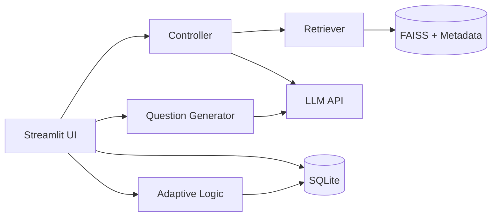
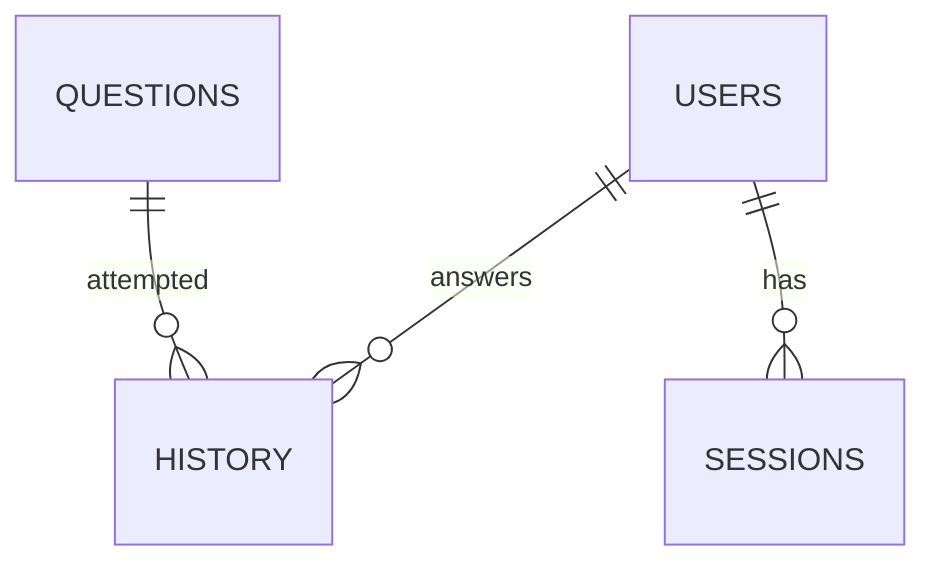

# Dàn ý thuyết trình dự án AI Tutor

Tài liệu này dùng để chuyển nội dung báo cáo thành slide thuyết trình. Mỗi mục tương ứng một slide đề xuất. Khi làm PowerPoint/Canva, nên giữ mỗi slide ngắn gọn, ưu tiên sơ đồ, ảnh chụp giao diện và demo trực tiếp.

---

## Slide 1. Tiêu đề

**AI Tutor - Hệ thống trợ lý học tập cá nhân hóa ứng dụng RAG và học thích nghi**

Nội dung hiển thị:

- Tên học phần
- Tên giảng viên
- Tên sinh viên/nhóm
- Lớp, mã sinh viên

Gợi ý lời nói:

> Em/nhóm em xin trình bày đề tài AI Tutor, một hệ thống trợ lý học tập cá nhân hóa kết hợp chatbot dựa trên tài liệu, luyện tập trắc nghiệm và dashboard phân tích kết quả học tập.

---

## Slide 2. Lý do chọn đề tài

Nội dung hiển thị:

- Nhu cầu học tập cá nhân hóa ngày càng cao.
- Chatbot thông thường có thể trả lời không bám sát tài liệu môn học.
- Người học cần công cụ vừa hỏi đáp, vừa luyện tập, vừa theo dõi tiến bộ.
- RAG giúp kết hợp LLM với tài liệu riêng.

Gợi ý lời nói:

> Điểm khác biệt của đề tài là không chỉ dùng AI để trả lời câu hỏi chung, mà còn đưa tài liệu học tập vào quá trình trả lời thông qua RAG. Ngoài ra, hệ thống có cơ chế điều chỉnh độ khó theo lịch sử làm bài của người học.

---

## Slide 3. Mục tiêu dự án

Nội dung hiển thị:

- Xây dựng chatbot học tập dựa trên tài liệu.
- Tạo câu hỏi trắc nghiệm bằng AI.
- Lưu lịch sử làm bài và điều chỉnh độ khó.
- Hiển thị dashboard kết quả học tập.
- Đánh giá chất lượng truy xuất RAG.

Gợi ý lời nói:

> Mục tiêu của hệ thống là hỗ trợ toàn bộ quá trình học: từ hỏi đáp kiến thức, luyện tập, ghi nhận kết quả đến phân tích tiến độ.

---

## Slide 4. Công nghệ sử dụng

Nội dung hiển thị:

| Thành phần | Công nghệ |
| --- | --- |
| Giao diện | Streamlit |
| Database | SQLite |
| LLM | DeepSeek API qua OpenAI SDK |
| Embedding | Sentence Transformers |
| Vector search | FAISS |
| Dashboard | Plotly |
| Validation | JSON Schema |

Gợi ý lời nói:

> Hệ thống được xây dựng chủ yếu bằng Python. Streamlit giúp tạo giao diện nhanh, SQLite phù hợp cho bản demo local, FAISS và Sentence Transformers phục vụ truy xuất tài liệu, còn LLM được dùng cho chat và sinh câu hỏi.

---

## Slide 5. Kiến trúc tổng thể

Nội dung hiển thị:

Gợi ý lời nói:

> Hệ thống được chia thành nhiều module. UI chỉ chịu trách nhiệm hiển thị và nhận thao tác. Controller điều phối luồng chat. Retriever lấy tài liệu từ FAISS. Database lưu thông tin học tập, còn Adaptive Logic tính độ khó mới.

---

## Slide 6. Chức năng Chat Tutor có RAG

Nội dung hiển thị:

- Người học nhập câu hỏi.
- Hệ thống tìm top-k đoạn tài liệu liên quan.
- Đưa context vào prompt.
- LLM sinh câu trả lời.
- Trả về câu trả lời kèm nguồn tham khảo nếu có.

Gợi ý lời nói:

> Với RAG, câu hỏi của người học không được gửi trực tiếp cho LLM. Trước đó, hệ thống truy xuất các đoạn tài liệu liên quan nhất để làm ngữ cảnh, giúp câu trả lời bám sát tài liệu hơn.

---

## Slide 7. Chức năng luyện tập và học thích nghi

Nội dung hiển thị:

- Câu hỏi được lấy theo level hiện tại.
- Người học chọn đáp án A/B/C/D.
- Hệ thống lưu kết quả vào `history`.
- 3 câu đúng liên tiếp: tăng level.
- 2 câu sai liên tiếp: giảm level.
- Level nằm trong khoảng 1 đến 5.

Gợi ý lời nói:

> Cơ chế học thích nghi trong dự án được thiết kế đơn giản nhưng trực quan. Nếu người học làm tốt, hệ thống tăng độ khó. Nếu người học sai liên tiếp, hệ thống giảm độ khó để phù hợp hơn.

---

## Slide 8. Sinh câu hỏi bằng AI

Nội dung hiển thị:

- Admin nhập chủ đề, độ khó và số lượng câu hỏi.
- LLM sinh câu hỏi dạng JSON.
- Hệ thống validate theo `schema.json`.
- Câu hỏi hợp lệ được lưu vào SQLite.

Gợi ý lời nói:

> Để tránh dữ liệu AI sinh ra bị sai cấu trúc, hệ thống yêu cầu output dạng JSON và kiểm tra bằng JSON Schema trước khi lưu vào database.

---

## Slide 9. Dashboard học tập

Nội dung hiển thị:

- Tổng số câu đã làm.
- Số câu đúng.
- Độ chính xác.
- Streak hiện tại.
- Biểu đồ đúng/sai theo môn.
- Tiến trình học tập theo thời gian.
- Kết quả theo độ khó.

Gợi ý lời nói:

> Dashboard giúp người học hoặc giảng viên quan sát quá trình học, phát hiện môn/chủ đề còn yếu và theo dõi mức độ tiến bộ theo thời gian.

---

## Slide 10. Thiết kế dữ liệu

Nội dung hiển thị:

Bảng chính:

- `users`
- `questions`
- `history`
- `sessions`

Gợi ý lời nói:

> Database được thiết kế gọn, gồm user, câu hỏi, lịch sử làm bài và session. Bảng history là phần quan trọng để thống kê và tính độ khó thích nghi.

---

## Slide 11. Kiểm thử và đánh giá

Nội dung hiển thị:

- `compileall`: kiểm tra lỗi cú pháp.
- Import module chính: kiểm tra lỗi runtime cơ bản.
- `pip check`: kiểm tra xung đột dependency.
- Test flow database: init, insert, save history, adaptive level.
- `rag_tester.py`: Precision@3 và MRR.

Gợi ý lời nói:

> Trong phạm vi dự án, nhóm đã kiểm tra các luồng chính và có script riêng để đánh giá chất lượng truy xuất tài liệu. Tuy nhiên, hệ thống vẫn cần bổ sung test suite đầy đủ hơn trong tương lai.

---

## Slide 12. Kết quả đạt được

Nội dung hiển thị:

- Hoàn thiện app Streamlit với 3 tab chính.
- Có pipeline RAG cục bộ.
- Có sinh câu hỏi bằng AI.
- Có học thích nghi theo lịch sử trả lời.
- Có dashboard thống kê.
- Có dữ liệu mock và công cụ đánh giá retrieval.

Gợi ý lời nói:

> Kết quả là một hệ thống có thể chạy local, đủ các chức năng cơ bản của một AI Tutor: hỏi đáp, luyện tập, thích nghi và phân tích kết quả.

---

## Slide 13. Hạn chế

Nội dung hiển thị:

- Chưa có phân quyền user/admin đầy đủ.
- Chưa tối ưu cho nhiều người dùng đồng thời.
- Rebuild FAISS index còn thủ công.
- Chưa có test suite đầy đủ bằng `pytest`.
- Chất lượng phụ thuộc vào tài liệu và LLM.

Gợi ý lời nói:

> Đây là phiên bản prototype nên vẫn còn hạn chế, đặc biệt ở khả năng triển khai production và kiểm thử tự động. Tuy nhiên, kiến trúc hiện tại đủ rõ để tiếp tục mở rộng.

---

## Slide 14. Hướng phát triển

Nội dung hiển thị:

- Thêm đăng nhập và phân quyền.
- Upload tài liệu từ UI.
- Tự động rebuild vector store.
- Lưu chat history vào database.
- Nâng cấp SQLite lên PostgreSQL khi triển khai thực tế.
- Cải thiện adaptive learning theo mastery score.

Gợi ý lời nói:

> Trong tương lai, hệ thống có thể phát triển thành nền tảng học tập cho nhiều lớp, nhiều môn học và nhiều người dùng, với phần quản trị tài liệu và ngân hàng câu hỏi đầy đủ hơn.

---

## Slide 15. Demo hệ thống

Kịch bản demo đề xuất:

1. Chạy app bằng `streamlit run app.py`.
2. Tạo hoặc tải user trong sidebar.
3. Mở tab Exercise và trả lời một câu hỏi.
4. Cho thấy lịch sử làm bài ảnh hưởng tới level.
5. Mở tab Dashboard để xem thống kê.
6. Mở tab Chat và đặt câu hỏi liên quan tài liệu.
7. Mở Admin Panel để sinh câu hỏi mới.

Gợi ý lời nói:

> Phần demo sẽ minh họa trực tiếp các chức năng chính: luyện tập, dashboard, chatbot RAG và sinh câu hỏi bằng AI.

---

## Slide 16. Kết luận

Nội dung hiển thị:

- Đề tài đã xây dựng được bản mẫu AI Tutor hoàn chỉnh ở mức local.
- RAG giúp chatbot bám sát tài liệu.
- Học thích nghi giúp cá nhân hóa quá trình luyện tập.
- Hệ thống có tiềm năng mở rộng thành nền tảng học tập thực tế.

Gợi ý lời nói:

> Qua đề tài, em/nhóm em đã vận dụng được các kiến thức về Python, cơ sở dữ liệu, AI API, RAG và thiết kế phần mềm để xây dựng một hệ thống có tính ứng dụng trong giáo dục.

---

## Slide 17. Câu hỏi và trả lời

Nội dung hiển thị:

**Xin cảm ơn thầy/cô và các bạn đã lắng nghe.**

Gợi ý chuẩn bị câu trả lời:

- Vì sao chọn RAG thay vì fine-tune?
- Vì sao dùng SQLite?
- FAISS hoạt động như thế nào?
- Cơ chế adaptive learning có thể cải tiến ra sao?
- Nếu triển khai thực tế cần bổ sung gì?

---

# Gợi ý thiết kế slide

- Mỗi slide chỉ nên có 3-5 ý chính.
- Nên thêm ảnh chụp giao diện Chat, Exercise và Dashboard.
- Với slide kiến trúc, dùng sơ đồ thay vì nhiều chữ.
- Với slide demo, trình bày trực tiếp trên app sẽ hiệu quả hơn ảnh tĩnh.
- Font nên rõ ràng, cỡ chữ tối thiểu 24 với nội dung chính.
- Màu sắc nên thống nhất, tránh quá nhiều hiệu ứng.

# Câu hỏi giảng viên có thể hỏi

## 1. RAG khác gì chatbot thông thường?

RAG bổ sung bước truy xuất tài liệu trước khi gọi LLM. Nhờ vậy câu trả lời có thêm ngữ cảnh từ tài liệu nội bộ, giảm rủi ro trả lời lệch nội dung.

## 2. Vì sao không fine-tune mô hình?

Fine-tune tốn chi phí, cần dữ liệu huấn luyện và khó cập nhật thường xuyên. RAG phù hợp hơn vì chỉ cần thay đổi tài liệu và rebuild index.

## 3. Vì sao dùng SQLite?

SQLite nhẹ, dễ cài đặt và phù hợp với bản demo chạy local. Nếu triển khai nhiều người dùng, có thể chuyển sang PostgreSQL hoặc hệ quản trị cơ sở dữ liệu mạnh hơn.

## 4. Cơ chế học thích nghi hiện tại có hạn chế gì?

Cơ chế hiện tại dựa trên streak đúng/sai nên đơn giản và dễ hiểu, nhưng chưa đánh giá sâu theo từng chủ đề. Có thể cải tiến bằng mastery score hoặc mô hình dự đoán năng lực.

## 5. Làm thế nào để đánh giá RAG?

Dự án có `rag_tester.py`, tự tạo 20 test query từ metadata và tính Precision@3 cùng MRR để đánh giá khả năng truy xuất đúng tài liệu liên quan.
